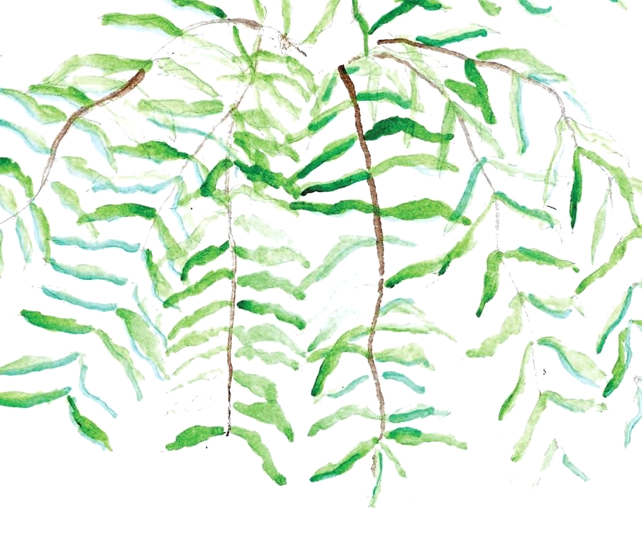
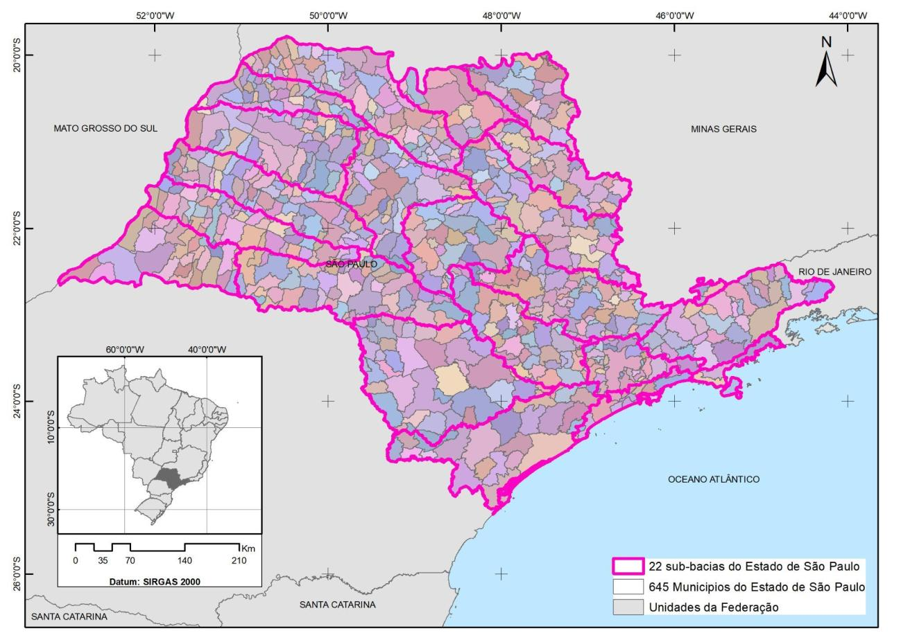
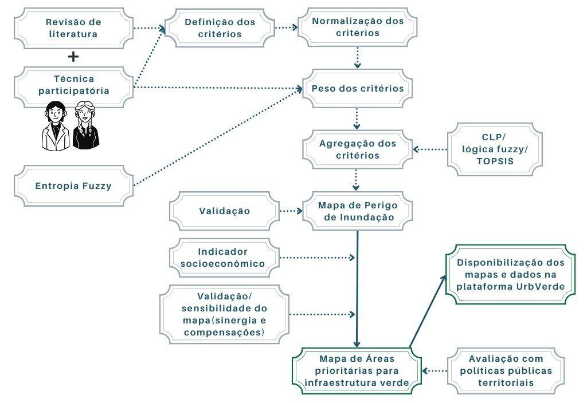
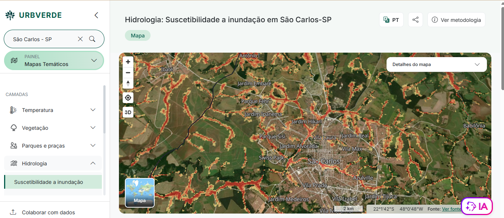
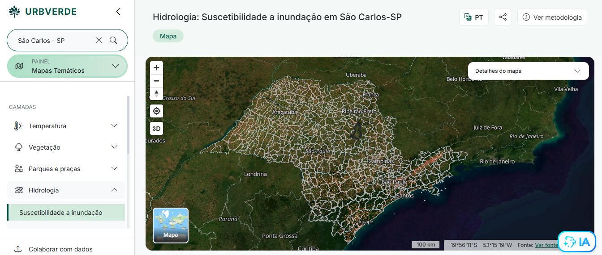
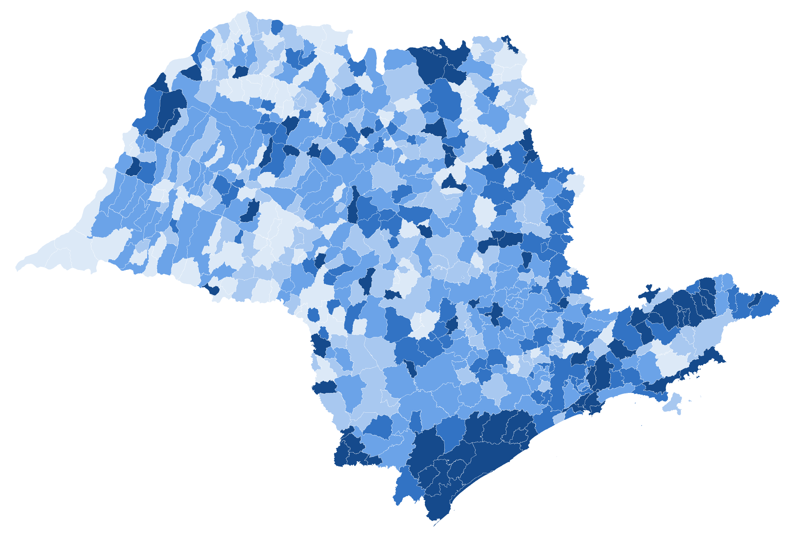
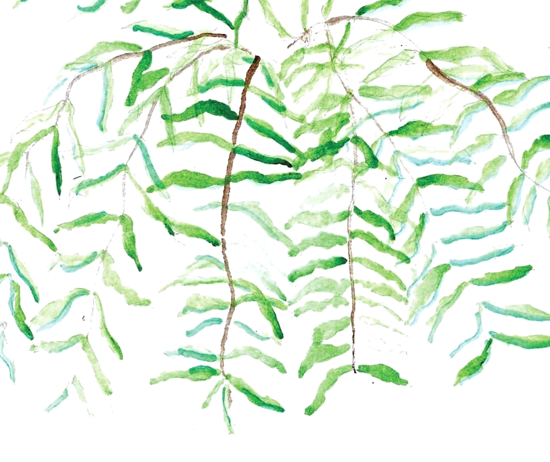

  
Pós-doutorado · FAPESP · IAU-USP

  
Território, mudanças climáticas e equidade

  
Gestão de inundações e planejamento urbano integrado no Estado de São Paulo

  <b>Dra. Marina Pannunzio Ribeiro</b> 
  Orientador Prof. Dr. Marcel Fantin 
  Instituto de Arquitetura e Urbanismo de São Carlos — USP

---

Em pauta · 10 de setembro de 2026

# Prefeitura de São Paulo publica 3ª edição do Plano Diretor de Drenagem

201 intervenções que visam a redução de alagamentos. Plano elaborado pela SIURB em parceria com a USP incorpora soluções baseadas na natureza.

  

    
201

    
intervenções para reduzir alagamentos na cidade de São Paulo

  

  

    
R$ 16,5 bi

    
em investimentos previstos

  

  

    
SbN

    
soluções baseadas na natureza incorporadas ao plano

  

  <b>3ª edição do plano</b>, elaborada pela Secretaria Municipal de Infraestrutura Urbana e Obras (SIURB) em parceria com a USP.

Fonte: Prefeitura de São Paulo, notícia de 10 set. 2026.

---

Contexto

# O problema

  
As cidades concentram população, atividades econômicas e infraestrutura e estão, ao mesmo tempo, entre os territórios mais vulneráveis às mudanças climáticas — em especial às inundações urbanas.

  
No Estado de São Paulo, a recorrência de chuvas extremas tem exposto limitações estruturais do planejamento urbano e a fragilidade da capacidade de resposta.

  
A infraestrutura verde — parques, várzeas, jardins de chuva, arborização — responde a esse quadro por ser multifuncional. Mas costuma ser planejada por um único benefício e distribuída de forma desigual entre grupos sociais.

  
<b>Falta um instrumento que priorize território integrando, de uma só vez, suscetibilidade física, vulnerabilidade social e serviços ecossistêmicos.</b>

  

    
4 em 5

    
pessoas viverão em áreas urbanas até 2050, altamente expostas a eventos extremos (Dodman et al., 2022)

  

  

    
645

    
municípios paulistas, distribuídos em 22 Unidades de Gerenciamento de Recursos Hídricos

  

  

    
44 milhões

    
de habitantes em 248.219 km² — a terceira maior densidade do país (Censo 2022)

  

<!--
178,92 habitantes por quilômetro quadrado
-->

---

Estado da arte

# Quatro lacunas — e a resposta do projeto

  

    
1Escala e comparabilidade

    
Os modelos multicritério aplicados a inundações e infraestrutura verde são quase sempre locais, restritos a um município ou a uma bacia.

    
<b>Modelo em escala estadual, mantendo resolução intraurbana pelo setor censitário.</b>

  

  

    
2Integração entre o ambiental e o social

    
Os benefícios da infraestrutura verde são tratados setorialmente e a vulnerabilidade social permanece periférica ao processo decisório.

    
<b>Suscetibilidade, vulnerabilidade social e serviços ecossistêmicos como critérios estruturantes.</b>

  

  

    
3Subjetividade e reprodutibilidade

    
A ponderação apoiada apenas em julgamento de especialistas introduz viés e compromete a consistência em territórios heterogêneos.

    
<b>Ponderação híbrida: Processo Analítico Hierárquico combinado com Entropia Fuzzy.</b>

  

  

    
4Transferência e uso institucional

    
Os estudos permanecem no meio acadêmico, com baixa tradução em instrumentos de apoio à decisão e às políticas públicas.

    
<b>Implementação na plataforma UrbVerde, com metadados padronizados e acesso aberto.</b>

  

---

Objetivo geral

# Um modelo espacial de priorização territorial

  

    
<b>Desenvolver um modelo espacial de Avaliação Multicritério de Decisão para identificar áreas prioritárias para a implementação de infraestrutura verde,</b>

    
de modo a apoiar o planejamento territorial orientado à adaptação urbana frente às inundações, considerando as sinergias e compensações relacionadas ao enfrentamento do calor extremo e à mitigação do déficit de natureza nas cidades do Estado de São Paulo.

    
Busca-se localizar os territórios onde os benefícios ecossistêmicos sejam maximizados e contribuam para a adaptação e a resiliência climática urbana.

  

  

    
<b>O que o modelo não é</b>

    
Não define tipologias específicas de infraestrutura verde.

    
Não substitui estudos técnicos nem projetos executivos em escala local.

    
Não dispensa as etapas posteriores de detalhamento técnico e projetual.

    
<b>Não é um mapa de intervenção: é o passo que antecede o projeto.</b>

  

  É um instrumento de priorização: indica onde diferentes escalas de intervenção — macro, meso e micro — poderão ser avaliadas nas etapas seguintes do planejamento urbano e ambiental.

---

Hipóteses

# O que o projeto se propõe a testar

  
H1A Avaliação Multicritério de Decisão integrada a dados geoespaciais permite identificar de forma eficaz as áreas prioritárias para infraestrutura verde no apoio ao planejamento orientado à adaptação frente às inundações.

  
H2As áreas de vulnerabilidade social tendem a apresentar simultaneamente maior exposição à ocorrência de inundações, déficit de natureza e ilhas de calor.

  
H3A incorporação de múltiplos critérios ambientais e sociais resulta em decisões de planejamento territorial mais equitativas e resilientes.

  
H4Existe sobreposição significativa entre as áreas prioritárias para controle de inundações, mitigação do calor extremo e ampliação do acesso a áreas verdes.

---

Área de estudo

# Recorte estadual, análise intraurbana

  

    
    
Figura 1. Localização do Estado de São Paulo, seus 645 municípios e as 22 sub-bacias. Fonte: Ribeiro (2025).

  

  

    
<b>Recorte e unidade de análise</b>

    
<b>Estado de São Paulo</b> 645 municípios, 248.219 km² e mais de 44 milhões de habitantes (Censo 2022).

    
<b>22 Unidades de Gerenciamento de Recursos Hídricos</b> Cada uma com seu Comitê de Bacia Hidrográfica — interlocutores da etapa participativa.

    
<b>Universo analítico</b> Apenas os setores censitários urbanos do IBGE. Toda a análise é intraurbana, o que assegura alta resolução espacial e comparabilidade entre municípios.

    
<b>Padronização cartográfica</b> Resolução de 30 m, UTM fusos 22 e 23 S, datum SIRGAS 2000.

  

---

Material e métodos

# O modelo conceitual

Avaliação Multicritério de Decisão: combinar relevo, drenagem, renda, saneamento e vegetação em um único mapa de prioridade.

  

    
    
Figura 2. Modelo espacial de Avaliação Multicritério de Decisão. Fonte: Ribeiro (2025).

  

  

    

      
Estruturar

      
Processo Analítico Hierárquico

      
Comparações par a par entre critérios, em workshops com a Defesa Civil do Estado e os comitês de bacia.

    

    

      
Objetivar

      
Entropia Fuzzy

      
Pesos derivados da variabilidade dos próprios dados, reduzindo o viés do perfil dos especialistas.

    

    

      
Agregar

      
CLP, lógica fuzzy e TOPSIS

      
Três abordagens testadas para identificar a mais adequada ao contexto analisado.

    

  

---

Critérios

# Três blocos, uma só base territorial

  

    
Bloco 1

    
Suscetibilidade à inundação

    
Onde o terreno é mais propenso a inundar

    <ul class="lista">
      <li>Declividade</li>
      <li>HAND — altura sobre a drenagem mais próxima</li>
      <li>Proximidade de rios e corpos d’água</li>
    </ul>
  

  

    
Bloco 2

    
Vulnerabilidade social

    
Quem está mais exposto e deve ser priorizado

    <ul class="lista">
      <li>Quantidade de moradores</li>
      <li>Renda da pessoa responsável pelo domicílio</li>
      <li>Acesso a abastecimento de água</li>
      <li>Acesso a coleta de esgoto</li>
      <li>Acesso a coleta de lixo</li>
    </ul>
    
Censo Demográfico 2022 (IBGE), por setor censitário

  

  

    
Bloco 3

    
Potencial ambiental

    
Onde a intervenção gera benefícios múltiplos

    <ul class="lista">
      <li>Temperatura da superfície terrestre — UrbVerde</li>
      <li>Cobertura vegetal — modelo linear de mistura espectral</li>
      <li>Parques e praças — OpenStreetMap</li>
      <li>Unidades de Conservação — Cadastro Nacional</li>
    </ul>
    
Sinergias e compensações entre calor extremo e déficit de natureza

  

  Todos os critérios são padronizados a 30 m, UTM 22/23 S e SIRGAS 2000, e normalizados na escala 0–1 antes da agregação.

---

Resultados

# Produtos, validação e disponibilização

  

    i
    
Mapa de suscetibilidade à ocorrência de inundações urbanas

    
Para todo o Estado de São Paulo, em resolução intraurbana.

  

  

    ii
    
Indicador espacial sintético de vulnerabilidade socioeconômica

    
Identifica os grupos prioritários nas estratégias de adaptação.

  

  

    iii
    
Mapa sintético de áreas prioritárias para infraestrutura verde

    
Integra as três dimensões, com atenção à maior vulnerabilidade social.

  

  

    
<b>Validação</b>

    <ul class="lista">
      <li>Cadastro Georreferenciado de Eventos Geodinâmicos, 1993–2013 (Instituto Geológico).</li>
      <li>Registros da Defesa Civil do Estado de São Paulo.</li>
      <li>Verificação em campo por amostragem, com tabela de indicadores.</li>
      <li>Análise de correlação entre critérios e análise de sensibilidade dos pesos.</li>
    </ul>
  

  

    
<b>Disponibilização na plataforma UrbVerde</b>

    <ul class="lista">
      <li>Ficha de metadados obrigatória na abertura de cada camada.</li>
      <li>Perfil de Metadados Geoespaciais do Brasil 2.0, compatível com a ISO 19115-1.</li>
      <li>Pacote de download com metadados em PDF/HTML e em JSON/XML.</li>
      <li>Ciência aberta, rastreabilidade e apropriação de competências de gestão.</li>
    </ul>
  

---
semRodape: true
---

  

    i
    

      
Mapa de suscetibilidade à ocorrência de inundações urbanas

      
Para todo o Estado de São Paulo, em resolução intraurbana.

    

  

  <a class="c-suave" style="font-size:10px;" href="https://urbverde.iau.usp.br/mapa?code=3548906&viewMode=map&type=city&year=2026&category=hidro&layer=flood_susceptibility_state&scale=intraurbana" target="_blank">Mapa ao vivo · plataforma UrbVerde ↗</a>

<iframe
  src="https://urbverde.iau.usp.br/mapa?code=3548906&viewMode=map&type=city&year=2026&category=hidro&layer=flood_susceptibility_state&scale=intraurbana"
  class="absolute"
  style="left:0; top:104px; width:1400px; height:640px; border:0; transform:scale(0.7); transform-origin:0 0;"
  allow="fullscreen; geolocation"
></iframe>

<!--
Mapa interativo: dá para dar zoom, mudar de município na busca e trocar de camada ao vivo.
Precisa de internet. Sem conexão, use os dois slides seguintes (ocultos), com as capturas de tela.
-->

---
semRodape: true
hide: true
---

  i
  

    
Mapa de suscetibilidade à ocorrência de inundações urbanas

    
Para todo o Estado de São Paulo, em resolução intraurbana.

  

---
semRodape: true
hide: true
---

  i
  

    
Mapa de suscetibilidade à ocorrência de inundações urbanas

    
Para todo o Estado de São Paulo, em resolução intraurbana.

  

---
semRodape: true
---

  i
  

    
Mapa de suscetibilidade à ocorrência de inundações urbanas

    
Para todo o Estado de São Paulo, em resolução intraurbana.

  

  Figura 1. Proporção da área urbana municipal — apenas setores censitários de situação urbana — classificada na mancha de suscetibilidade. Modelo v1.1, 60 m.

---
semRodape: true
---

  

    “Si eres una mujer fuerte protégete con palabras y árboles e invoca la memoria de mujeres antiguas”
  

  
Gioconda Belli

  

    <b>Dra. Marina Pannunzio Ribeiro</b> 
    IAU-USP · plataforma UrbVerde · urbverde.iau.usp.br
  

